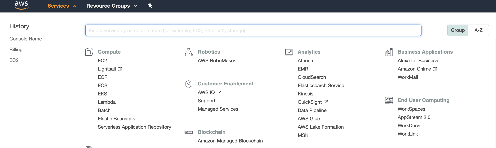

# AWS Certified Solutions Architect Associate (CSAA)

1. [Introduction](#intro)
    1. [Cloud](#intro-cloud)
    2. [AWS](#intro-aws)
2. [AWS Account](#account)
    1. [Account creation](#account-creation)
    2. [Console](#account-console)
    3. [Billing Alarm](#account-billing)
3. [Identity and Access Management (IAM)](#iam)
    1. [Principals](#iam-principals)
    2. [Policies](#iam-policies)
    3. [Users and Groups](#iam-users-groups)
    4. [Roles](#iam-roles)
    5. [Multi Factor Authentification (MFA)](#iam-mfa)
3. [Simple storage service (S3) and Glacier](#s3)
4. [end](#iam)

<div id='intro'/></div>

# Introduction

<div id='intro-cloud'/></div>

## Cloud Computing

Cloud computing is the on-demand delivery of IT resources and applications via the Internet
with pay-as-you-go pricing. In reality, a cloud server is in a data center all around the world.

<p align="center">

</p>

Whether you run applications that share photos to millions of
mobile users or deliver services that support the critical operations of your business, the
cloud provides rapid access to flexible and low-cost IT resources. With cloud computing, you
don’t need to make large up-front investments in hardware and spend a lot of time managing
that hardware. Instead, you can provision exactly the right type and size of computing
resources you need to power your newest bright idea or operate your IT department. With
cloud computing, you can access as many resources as you need, almost instantly, and only
pay for what you use.

In its simplest form, cloud computing provides an easy way to access servers, storage,
databases, and a broad set of application services over the Internet. Cloud computing
providers such as AWS own and maintain the network-connected hardware required for these
application services, while you provision and use what you need for your workloads.

### Example

For a company if they are using their own servers, they have an architecture on premise.

If the company has 1000 users in 2016 and 2000 users in 2017 then some other servers will be needed. In the future the company might also want to install servers in order to anticipate the future number of user. If you use an architecture on premise and have less users than you thought some of the servers you bought are becoming useless.

<p align="center">

</p>

Whereas using the cloud, the infrastructure can be scaled to fit the need of the company.

<p align="center">

</p>

As seen previously, Cloud computing has some real benefits :
* **variable expense** : we don't need to invest in huge data centers you may not use. You pay for how much you consume !
* **available in minutes** : new IT resources can be accessed within minutes.
* **economies of scale** : because of the number of users. Cloud providers can achieve higher economies of scale translating in lower prices.
* **global in minutes** : cloud architectures can be deployed really easily all around the world.

Deployments using the cloud can be `all-in-cloud-based` (the entire infrastructure is in the cloud) or `hybrid` (using on premise and cloud).

<div id='intro-aws'/></div>

## Amazon Web Services (AWS)

Amazon Web Service (AWS) is a cloud service provider, also known as infrastructure as a service (`IaaS`). AWS is the clear market leader in this domain and offers many services compared to other cloud providers.

AWS has some interesting proporties as :
* **High availability** : Any file can be accessed from anywhere
* **Fault tolerance** : If an AWS server fails. You can still retrieve the file (the fault tolerancy is due to redundancy)
* **Scalibility** : Possibility to add more servers when needed
* **Elasticity** : Possibility to grow or shrink infrastructure

### Global Infrastructure

AWS provides a highly available technology infrastructure platform with multiple locations
worldwide. These locations are composed of `regions` and `availability zones`. 

Each region is a separate geographic area. Each region has multiple, isolated locations known as availability zones. An availibity zone is a physical data center geographically seperated from other availibility zones.

<p align="center">

</p>

We can achieve high availability by deploying your application across multiple availability zones. 

### Security

The AWS infrastructure has been designed to provide the highest availability while putting strong safeguards in place regarding customer privacy and segregation. When deploying systems on the AWS Cloud computing platform, AWS helps by sharing the security
responsibilities with the organization. AWS manages the underlying infrastructure, and the organization can secure anything it deploys on AWS. This affords each organization the
flexibility and agility they need in security controls.

### Compliance

When customers move their production workloads to the AWS Cloud both parties become responsible for managing the IT environment. Customers are responsible for setting up their
environment in a secure and controlled manner. Customers also need to maintain adequate governance over their entire IT control environment.

Organizations retain complete control and ownership over the region in which their data is physically located, allowing them to meet regional compliance and data residency requirements.

<div id='account'/></div>

# AWS Account

<div id='account-creation'/></div>

## AWS account creation

When we create a new account on AWS, we have an AWS Free Tier. It allows us to use some of AWS resources for free each month during one year.

In order to create an AWS account, we must go to the following address [aws.amazon.com](aws.amazon.com).

Then we click on the create an account button and fill the following form.

<p align="center">

</p>

We choose a `personnal` account type and fill the rest of the forms.

<p align="center">


</p>

Then we choose the `basic plan`, which is free.

To connect to aws we use our email and password. We will then access to your root account. The root account must not be used directly when using AWS resources for security purposes. We will later create IAM users to use AWS resources more safely.

<div id='account-console'/></div>

## AWS console

The console allows to search for specific services. by default they are sorted by group but can be sorted alphabetically.

<p align="center">

</p>

We notice there is a link for resource group. Resource groups allow us to take a collection of aws resources and assign a tag (a label) to them so we can manage them as a group.

The pushpin is for one-click navigation. It allows us to create shortcuts for most commonly used resources.

<p align="center">

</p>

The alarm icon allows us to see all system alerts. If we click we will see more details about the issues and their current status.

<p align="center">

</p>

Then we have account information and the selected AWS regions we are working on (all resources are not available for every regions).

Support center allows us to create cases when we encounter problems (we can see support plan here, which will influence aws response time).

<div id='account-billing'/></div>

## Creating a billing Alarm

We first type `billing` into aws search services bar. 

<p align="center">

</p>

Then we can go in `Billing preferences` section and validate `Receive Free Tier Usage Alerts` (we have to enter an email). We can also set `Receive Billing Alerts` then we have to save preferences. We can now receive billing alerts !

Now we need to go CloudWatch to configure a billing alert. Cloudwatch is the AWS monitoring system use to track performances of used AWS resources.

We go into `CloudWatch` section. We go into the `Alarm/Billing` subsection. Then we can `create alarm`. 

<p align="center">

</p>

We have to `select metric`. Two types of metric exists : `by service` or `Total estimated charges`. We are going to select `Total estimated charges` and `USD` as currency. The threshold we want is `static` and `greater or equal` to 1 $.

<p align="center">

</p>

On the configure actions page. we are going to keep `in alarm`. For the notification we use SNS (Simple Notification Service). We are going to `create a new topic` with the name "BillingAlarm" and we need to enter to enter our email address. Then we can create the SNS topic.

For the SNS topic to work, we need to confirm our email address (confirmation in the AWS email).

Then we can select `select an existing SNS topic` with "BillingAlarm".

We can then add the name and the description of the alarm. Our alarm is finally created !

<p align="center">

</p>


<div id='iam'/></div>

# Identity and Access Management (IAM)

IAM is a powerful service that allows you to control how people and programs are allowed to
manipulate our AWS services. IAM uses traditional identity concepts such as users,
groups, and access control policies to control who can use your AWS account, what services
and resources they can use, and how they can use them

We can create an AWS user and allow/restrict access to specific AWS services. 

IAM is not linked to permissions within applications but the ones to access AWS resources. IAM is a global service, all the access/restrictions are global.

The usage of IAM is free !

<div id='iam-principals'/></div>

## Principals

The first IAM concept to understand is **principals**. A principal is an IAM entity that is allowedto interact with AWS resources.

A principal can be permanent or temporary, and it can represent a human or an application. There are three types of principals: **root users**, **IAM users**, and **roles/temporary security tokens**.

### Root User

When you first create an AWS account, you begin with only a single sign-in principal that has
complete access to all AWS Cloud services and resources in the account. This principal is
called the root user. As long as you have an open account with AWS, the root user for that
relationship will persist.

Their access cannot be limited.

### IAM Users

IAM Users are persistent identities set up through the IAM service to represent individual people or applications. They are often used to differenciate admin, dev, test, and production users accesses for applications that need AWS.

Any new user account created are not given access to any AWS resources. We must explicitely grant persmission to user to give him access to resources.

Their access is controled by policies.

### Roles and Temporary security tokens

Roles and temporary security tokens are very important for advanced IAM usage, but many
AWS users find them confusing. Roles are used to grant specific privileges to specific actors
for a set duration of time. 

Roles grants access from one service to another.
Using IAM roles for Amazon EC2 removes the need to store AWS credentials in a configuration file

Their access are controled by limited-in-time policies. 

###  Amazon resource name

Every resource created on AWS has an Amazon resource name (ARN). The format of ARN consists in : `arn:partition:service:region:account:resource`
* **partition** : partition the resource is in (most of the time `aws`).
* **service** : identifies the AWS product. For IAM we will have `iam`.
* **region** : the region the resource resides in (blank for IAM).
* **account** : the AWS account ID.
* **resource** : identifies the resource by name.

Here is an example of ARN: `arn:aws:iam::796318409053:user/Adrian`

ARN are important part of IAM policies.

Resources are also linked to paths (most of the time `/`) that can be more complicated when matching a company organization. 

<div id='iam-policies'/></div>

## Policies

A policy is a JSON document that fully defines a set of permissions to access and manipulate AWS resources. Policy documents contain one or more permissions, with each
permission defining :
* **Sid** : statement identifier
* **Effect** : a single word (Allow or Deny)
* **Service** : The service from which the permission apply.
* **Resource** : The resource value specifies the specific AWS infrastructure for which this
permission applies. This is specified as an Amazon Resource Name (ARN).
* **Action** : The action value specifies the subset of actions within a service that the
permission allows or denies.
* **Condition** : The condition value optionally defines one or more additional restrictions that limit the actions allowed by the permission.

```
{
    "Version": "2012–10–17",
    "Statement": [
        {
            "Sid": "Stmt1441716043000",
            "Effect": "Allow", <- This policy grants access
            "Action": [ <- Allows identities to list
                "s3:GetObject", <- and get objects in
                "s3:ListBucket" <- the S3 bucket
            ],
            "Condition": {
                "IpAddress": { <- Only from a specific
                    "aws:SourceIp": "192.168.0.1" <- IP Address
                }
            },
            "Resource": [
                "arn:aws:s3:::my_public_bucket/*" <- Only this bucket
            ]
        }
    ]
}
```

A policy can ba attached to either principals (users, groups, roles) or resources (S3 bucket).

### Identity based policies

`Identity based policies` are policies that can be attached to a principal (or identity), such as IAM userm, group, role. They control the action of that identity, on which resource and under what condition.

They can be categorized in two types:
* **Managed policies** : standalone identity based policies. They can be AWS managed or customer managed (more precise control). They exists indenpendently from users.They can be managed by AWS or the customer.
* **Inline policies** : only exists in the context of the resource they are attached to.

Normally, managed policies are used as they can be reused but inline policies can be added to ensure any mistake change in managed policies will not grant access to resources.

### Resource based policies

`Resource based policies` are policies that can be attached to a resource (ex: S3 bucket). They control what actions a specified principal can perform on that resource and under what condition. They are inline policies only.

### Policy evaluation logic

<p align="center">

</p>

<div id='iam-users-groups'/></div>

## Users and Groups

AWS recommands we don't use our root account for day to day administrative tasks. For that, we are going to create a new IAM user and attach administrative access policy to it. as best practice AWS recommends we give users the minimum access to resources for users to accomplish their day to day tasks.

To create a user we go in the dashboard into the `users` section, then `add user`.

<p align="center">

</p>

We can enter the name of the new user. We have to select an access type. We select both `Programmatic access` and `AWS Management Console access`. Accesses will be seen later.
We can then select an automatically generated password or custom password (here a custom password is used) we can force the change of the password when the user logs in.

The second step is to set permissions for the new user. For the first user we are going to attach an `AdministratorAccess` policy (which gives the user a full access to all AWS services).

Then a tag can be added to the user (optionnal). The last step reviews all the options set for the user. The user is finally created !

<p align="center">

</p>

### Create group to assign permission

In the IAM dashboard we can go into `Groups`. We create a new group "OmegaAdmins". Then we have to attach an `AdministratorAccess` policy for the group, as we previously did for the user.

### Apply IAM password policy

The last step is to setup an IAM password policy. It dictates the format and expiration rules for passwords.

<p align="center">

</p>

We are going to click on `prevent password reuse` and set the number of passwords to be remembered to 3.

<div id='iam-roles'/></div>

## Roles

A role is intended to be assumable by anyone who needs it (EC2, user, mobile application ...). Roles are like a "superman cape", anyone who has it got the superpowers associated with it (here permissions).
Roles do not have long term credentials (access key). Instead, when someone asumes a role, a temporary security credential is created dynamically and provided to the user.

We can use role to users, applications or services that don't normally access our AWS ressources. Here are some examples :
* Users in our AWS account access to resources they do not usually have.
* Users in one AWS account access to resources in another account.
* A mobile app to use AWS resources without embedding AWS keys within the app.
* Users who already have identities defined outside of AWS, such as in our corporate directory

If an EC2 instance, a user and a mobile app want to access a S3 bucket, we should create a role and let them assume that role (instead of creating users).

<p align="center">

</p>

### Why roles can be preferred

It allows us to delegate access with defined permissions to trusted entities without having to share long-term access keys.

When EC2 accesses AWS resources such as S3 via IAM, the user's security credentials get stored on that EC2 instance. This should be avoided.

When the same EC2 instance assume a role, its credentials are not stored. This ensures a more secure way of accessing the resource. 

When to prefer roles over users :
* provide access for services to resources (ex: EC2 to S3)
* provide access for an IAM user in one AWS account (that we own) to resources in another AWS account (that we own).
* provide access for externally identified users.
* provide access to IAM users in AWS accounts owned by third parties.

A `role` is a set of permissions that grant access to actions and resources in AWS. These permissions are attached to the role, not to an IAM user or group.

`AWS service role` is a role that a service assumes to perform actions on our behalf.

`AWS service-linked role` is a role predefined by a service and include all the permissions the service requires to call other AWS services.

`Role chaining` happens when a role (A) grants access to another role (B). Thus you can assume role B through role A.

`Delegation` the granting of permissions to someone to allow access to resources we control.

`Federation` the creation of a trust relation between and external identity provider and AWS.

`Trust policy` is a JSON document which defines who is allowed to assume a role.

`Permission policy` is a JSON document defining the actions and resources a role can use.

`Principal` is an AWS entity that can perform actions and access resources (root account, IAM user or role).

`Role for cross-account access` granting access to resources in one account to a trusted principal in a different account.

### Creating a role

In the role dashboard, we click on create a role. We select EC2 and we attach S3 policy to it. For this example, we give the name "EC2Role".

For our dev group we are going to attach the EC2 and RDS policy.

If we have previously created a role (S3FullAccess) we can attach this role to an EC2 instance at creation time. 

A role is assumed by calling the AWS security token service (STS) AssumeRole APIs (AssumeRole, AssumeRoleWithWebIdentity and AssumeRoleWithSAML). These APIs return a set of temporary security credentials applications can use.

We can assign only one role with an EC2 instance.

A role can be assigned to an already running EC2 instance.

IAM roles do not requests AWS services directly. They have to be assumed by authorized entities such as IAM users, applications or AWS services.

IAM roles are free of charge !

<div id='iam-mfa'/></div>

## Multi factor authentication

Multi factor authentication provides another security level on the root acccount. That security is provided by a third-party, it provides a continually changing, random, 6 digit code the we will need to input along with our password when we log in to our root account.

There are two types of MFA devices. The first is a virtual MFA device. It can be a smartphone or a tablet and we use an application like google authentificator to generate the 6-digit code. The second one is an hardware key fob, it's a small physical device with a display we can attach to our keychain. You can get it directly from AWS.

How MFA works ?

When you want to login to an application, after entering the login and password you will have to enter the a MFA code which is sent to the MFA device or to the hardware MFA device. After entering the code, we are logged in to our AWS account.

To set MFA, we click on Manage MFA device with virtual MFA device. Then we have to install an AWS compatible MFA virtual software (authy or google authentificator).

## Best practices

Here are some of the best practices for IAM :
* Lock away AWS account root user access keys
* create individual IAM users
* configure a strong password policy
* rotate credentials regularly
* remove unecessary credentials
* enable MFA for privileged users
* use groups to assign permissions to IAM users
* use AWS defined policies to assign persmissions whenever possible
* use Policy conditions for extra security
* grant least privilege
* use Access levels to reviw IAM permissions
* use roles to delegate permissions
* monitor activity in the AWS account

<div id='s3'/></div>

# Simple storage service (S3) and Glacier

Amazon S3 provides developers and IT teams with secure, durable, and highly-scalable cloudstorage. Amazon S3 is easy-to-use object storage with a simple web service interface that youcan use to store and retrieve any amount of data from anywhere on the web. It is characterized by its :
* **durability** : it is designed to deliver 99.99% durability of objects over a given year.
* **availibility** : S3 buckets are saved in at least 3 availibility zones.

<p align="center">

</p>

* **scalibility** : bucket sizes will shrink/expand depending on the load.
* **fast** : multipart upload enables large object uploads.
* **reliable**
* **inexpensive** 

Common use cases for Amazon S3 storage include:
* Backup and archive for on-premises or cloud data
* Content, media, and software storage and distribution
* Big data analytics
* Static website hosting
* Cloud-native mobile and Internet application hosting
* Disaster recovery

To support these use cases and many more, Amazon S3 offers a range of storage classesdesigned for various generic use cases: general purpose, infrequent access, and archive.

Amazon Glacier is another cloud storage service related to Amazon S3, but optimized for dataarchiving and long-term backup at extremely low cost. Amazon Glacier is suitable for “colddata,” which is data that is rarely accessed and for which a retrieval time of three to five hoursis acceptable.


